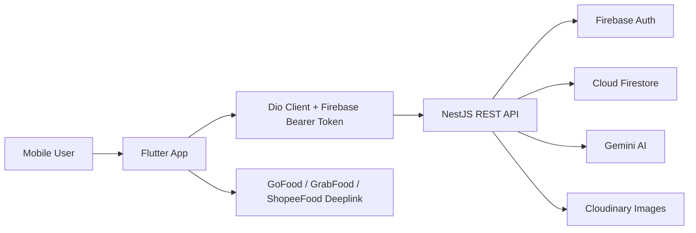
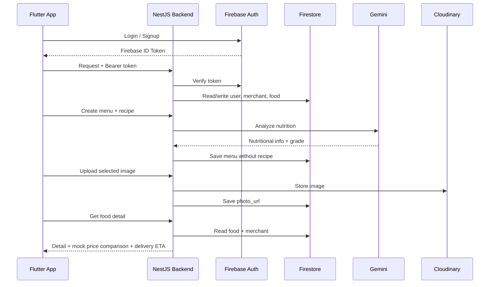

# GiziGo Monorepo

GiziGo adalah aplikasi agregator makanan sehat untuk mahasiswa. Proyek ini
berbentuk monorepo yang berisi aplikasi mobile Flutter dan backend NestJS.
Fokus utama sistem adalah membantu pengguna menemukan menu bergizi, melihat
rekomendasi yang sesuai preferensi makanan, membandingkan harga mock dari
platform pengiriman, serta mengelola menu melalui role merchant dan admin.

Dokumen teknis lengkap ada di [tech-spec.md](tech-spec.md). Detail khusus
backend ada di [backend/README.md](backend/README.md).

## Struktur Repository

```txt
gizigo/
+-- backend/      # NestJS REST API, Firebase Admin, Gemini, Cloudinary
+-- frontend/     # Flutter mobile app
+-- public/       # Asset publik/root placeholder
+-- tech-spec.md  # Spesifikasi teknis end-to-end
```

## Arsitektur Sistem



Frontend bertanggung jawab pada pengalaman pengguna, navigasi, autentikasi
Firebase client-side, pengambilan lokasi, pemilihan foto, dan render data.
Backend bertanggung jawab pada validasi token, role-based access control,
validasi DTO, logika rekomendasi, analisis gizi, akses Firestore, upload
Cloudinary, dan kontrak API.

## Backend

Backend berada di folder `backend/` dan dibangun dengan NestJS 11 + TypeScript.
Backend memakai Firebase Admin SDK untuk verifikasi ID token dan akses
Firestore, Gemini untuk analisis gizi serta ranking rekomendasi, Cloudinary
untuk penyimpanan gambar, dan Swagger/OpenAPI di `/api`.

Fitur backend utama:

- Auth sync melalui Firebase token: `/auth/sync` dan `/auth/signup`.
- Role `customer`, `merchant`, dan `admin` dengan guard berbasis Bearer token.
- Metadata publik: kategori makanan, grade nutrisi, dan goal nutrisi.
- Listing, search, detail, recently viewed, dan rekomendasi menu.
- Hard filtering rekomendasi dari `food_preferences`, misalnya vegetarian,
  vegan, plant-based, dan gluten-free.
- Gemini nutrition analysis saat create menu dan saat update menu jika request
  membawa `recipe`.
- `recipe` hanya dipakai saat request analisis dan tidak disimpan ke Firestore.
- Universal Mock Price Comparison dan Delivery ETA pada `GET /foods/:id`.
- Upload foto profil dan foto menu melalui multipart ke Cloudinary.
- Management merchant dan menu untuk role merchant/admin.
- Deployment serverless ke Vercel dengan root directory `backend`.

Kategori menu yang tersedia dari `/meta/food-categories`:

```txt
main_course, appetizers, snacks, desserts, beverages,
breakfast, lunch, dinner, salads
```

Grade nutrisi yang diterima untuk menu customer:

```txt
EXCELLENT, VERY_GOOD, GOOD
```

## Frontend

Frontend berada di folder `frontend/` dan dibangun dengan Flutter. Aplikasi
menggunakan `go_router` untuk navigasi, `dio` untuk HTTP client, Firebase Auth
untuk login/signup, `flutter_secure_storage` untuk penyimpanan token,
`flutter_riverpod` untuk state management pada bagian home, `geolocator` dan
`flutter_map` untuk lokasi, `image_picker` untuk foto, serta `url_launcher`
untuk membuka deeplink platform pengiriman.

Struktur frontend mengikuti pembagian `core` dan `features`:

```txt
frontend/lib/
+-- core/       # constants, network client, theme, widgets, services
+-- features/   # auth, home, search, food, location, profile, admin, merchant
+-- router/     # konfigurasi go_router
+-- main.dart
```

Fitur frontend utama:

- Splash, welcome, login, register customer, dan register merchant.
- Home dengan kategori dan rekomendasi dari `/foods/recommendations`.
- Search menu dengan filter kategori, grade nutrisi, harga, dan jarak.
- Detail menu dengan nutrition badge, merchant info, price comparison, ETA, dan
  deeplink pemesanan.
- Profile user, food preferences, upload foto profil, dan recently viewed.
- Select location dan penyimpanan recent locations.
- Admin dashboard, CRUD merchant, CRUD menu merchant, upload foto menu.
- Merchant dashboard, edit profil merchant, CRUD menu sendiri, upload foto menu.

Konstanta API berada di:

```txt
frontend/lib/core/constants/api_constants.dart
```

Default production API saat ini:

```txt
https://be-gizigo.vercel.app
```

Untuk menjalankan frontend ke backend lokal, gunakan `--dart-define`:

```bash
flutter run --dart-define=API_BASE_URL=http://localhost:3000
```

## Alur Data Utama



## Integrasi Backend dan Frontend

Kontrak JSON memakai `snake_case`, mengikuti field Firestore dan DTO backend.
Frontend menambahkan Firebase Bearer token secara otomatis melalui interceptor
`DioClient`. Jika token expired dan backend mengembalikan `401`, client mencoba
refresh Firebase token lalu retry request satu kali.

Endpoint penting yang dipakai frontend:

```txt
POST /auth/sync
POST /auth/signup
GET  /meta/food-categories
GET  /meta/nutrition-grades
GET  /meta/nutrition-goals
GET  /foods
GET  /foods/search
GET  /foods/recommendations
GET  /foods/:id
GET  /users/me
PATCH /users/me
POST /users/me/photo
GET  /users/me/recently-viewed
POST /users/me/recently-viewed
GET  /users/me/recent-locations
POST /users/me/recent-locations
GET  /merchant/me
PATCH /merchant/me
GET  /merchant/foods
POST /merchant/foods
GET  /merchant/foods/:id
PUT  /merchant/foods/:id
DELETE /merchant/foods/:id
POST /merchant/foods/:id/photo
GET  /admin/merchants
POST /admin/merchants
GET  /admin/merchants/:id
PUT  /admin/merchants/:id
DELETE /admin/merchants/:id
GET  /admin/merchants/:merchantId/foods
POST /admin/merchants/:merchantId/foods
GET  /admin/merchants/:merchantId/foods/:foodId
PUT  /admin/merchants/:merchantId/foods/:foodId
DELETE /admin/merchants/:merchantId/foods/:foodId
POST /admin/merchants/:merchantId/foods/:foodId/photo
```

## Setup Lokal

### Backend

Requirement:

```txt
Node.js 20.x
pnpm 10.x
```

Jalankan:

```bash
cd backend
pnpm install
cp .env.example .env
pnpm run start:dev
```

Isi `.env` backend dengan konfigurasi Firebase Admin, Cloudinary, dan Gemini:

```txt
FIREBASE_PROJECT_ID
FIREBASE_CLIENT_EMAIL
FIREBASE_PRIVATE_KEY
CLOUDINARY_CLOUD_NAME
CLOUDINARY_API_KEY
CLOUDINARY_API_SECRET
GEMINI_API_KEY
GEMINI_MODEL
GEMINI_TIMEOUT_MS
```

Server lokal berjalan di:

```txt
http://localhost:3000
```

Swagger tersedia di:

```txt
http://localhost:3000/api
```

Seed data Firestore:

```bash
cd backend
pnpm run seed:foods
```

### Frontend

Requirement:

```txt
Flutter SDK dengan Dart ^3.10.4
Firebase project configured
```

Jalankan:

```bash
cd frontend
flutter pub get
flutter run --dart-define=API_BASE_URL=http://localhost:3000
```

Jika memakai backend production, `API_BASE_URL` boleh tidak dikirim karena
frontend sudah memiliki default ke `https://be-gizigo.vercel.app`.

## Testing

Backend:

```bash
cd backend
pnpm run test
pnpm run test:e2e
pnpm exec tsc --noEmit
```

Jumlah unit test backend terakhir yang dijalankan: 79 test, 14 test suite.
File test backend berada di:

```txt
backend/src/**/*.spec.ts
backend/test/app.e2e-spec.ts
```

Frontend:

```bash
cd frontend
flutter test
```

## Deployment

Backend dideploy ke Vercel dengan konfigurasi di `backend/vercel.json`.
Gunakan root directory:

```txt
backend
```

Runtime flow backend di Vercel:

```txt
Request -> Vercel rewrite -> api/index.js -> dist/src/serverless.js -> NestJS
```

Environment variable production perlu diatur di Vercel, terutama Firebase,
Cloudinary, dan Gemini. Untuk Gemini di Vercel, rekomendasi timeout saat ini:

```txt
GEMINI_TIMEOUT_MS=20000
```

Frontend dapat dibuild untuk target mobile/web sesuai workflow Flutter. Pastikan
`API_BASE_URL` mengarah ke backend yang benar saat build/run.

## Catatan Implementasi Penting

- Harga GoFood/GrabFood/ShopeeFood bukan harga live dari API eksternal.
  Backend membuat Universal Mock dari `base_price`, platform, window UTC enam
  jam, dan bucket jarak.
- Estimasi pengiriman juga mock universal. Jika frontend mengirim `lat` dan
  `lng` ke detail menu, backend memakai jarak user ke merchant sebagai dasar
  bucket ETA.
- Recommendation home memakai hard filter dari preference yang jelas, lalu
  ranking Gemini jika tersedia. Jika Gemini gagal, backend memakai fallback
  ranking lokal.
- Saat edit menu, backend tidak mengembalikan `recipe` karena memang tidak
  disimpan di Firestore. Field metadata, price, image, kategori, label, status,
  dan deeplink tetap dikembalikan untuk default value form edit.
- Upload foto menu dipisahkan dari create menu agar gambar tidak tersimpan jika
  analisis Gemini menolak menu.

## Referensi

- [tech-spec.md](tech-spec.md) untuk spesifikasi teknis lengkap.
- [backend/README.md](backend/README.md) untuk detail backend dan deployment
  Vercel.
- [frontend/README.md](frontend/README.md) untuk catatan dasar Flutter project.
